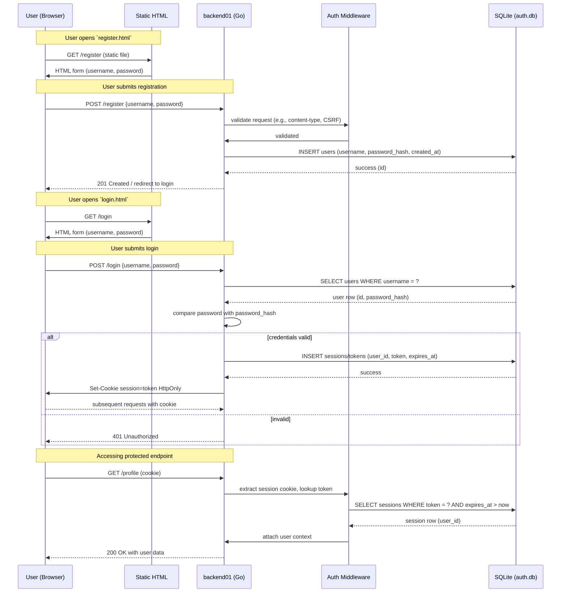
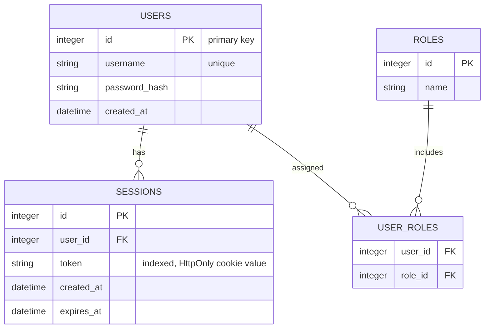

## System Diagrams for backend01

This document contains system diagrams (sequence and ER diagrams) in Mermaid format describing the main authentication flows and data model for the `backend01` service.

### Sequence Diagram — Register and Login

### ER Diagram — Data Model

### Notes and mapping to repository

- Handlers: `auth.go` likely implements `/register` and `/login` endpoints.
- Models: `models.go` defines `User` and possibly `Session` structures.
- Database: `db.go` opens `auth.db` (SQLite) and performs CRUD.
- Middleware: `middleware.go` shows request validation and session extraction.
- Entrypoint: `main.go` wires routes, static files, and middleware.

You can render these diagrams in editors that support Mermaid (GitHub, VS Code with Mermaid preview, or mermaid.live).
